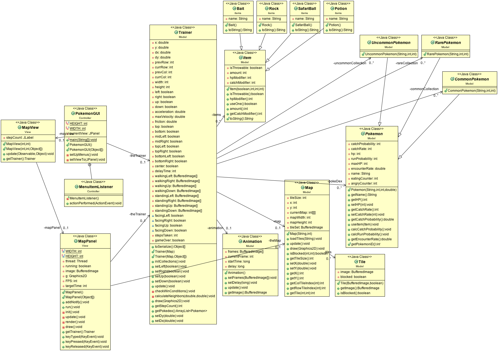

# MergeConflictAnonymous's Pokemon Safari Zone
**Authors: Angel Burr, Paul Castleberry, Issac Kim, Sohyun Kim**

*CSc 335, Spring 17*

The main GUI is run with the PokemonGUI class in the Controller package.

- Iteration 1 Details:
    - The Trainer class acts as the game representation class (as described in the first requirement under the Model section in Iteration 1's spec).
    - Model classes are tested to >90% coverage
    - No battles
    - Animation on the map view is complete
    - Persistence is fully working

UML Class Diagram of Iteration 1 (also see PokemonClassDiagram.ucls in the root of the src folder):

